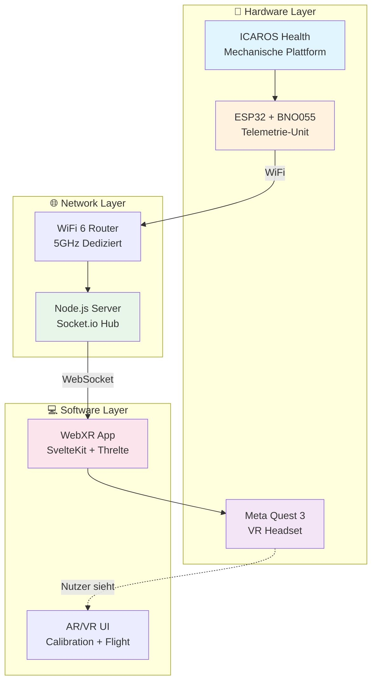
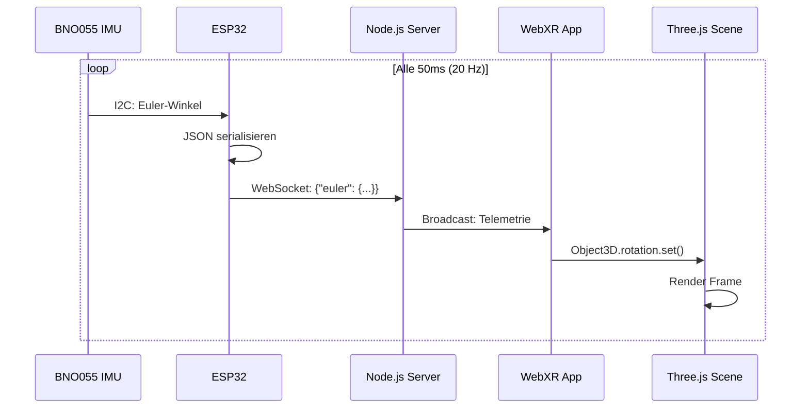
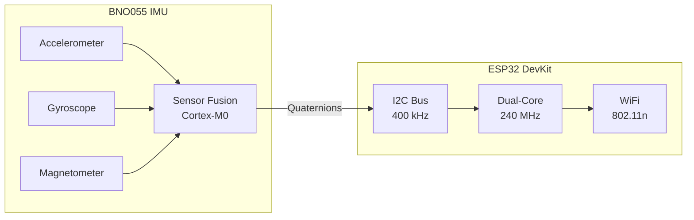
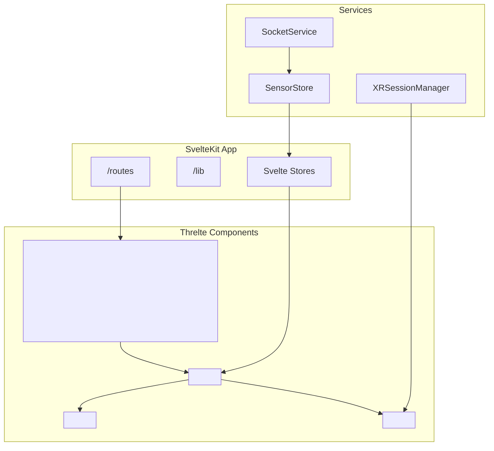
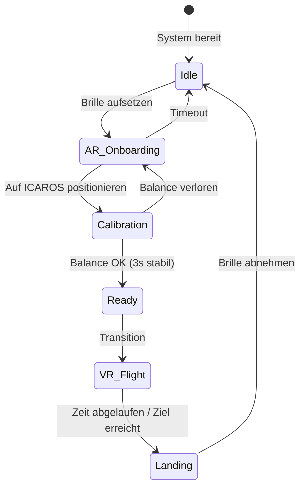

# PROJEKT_STRUKTUR.md
## Icaros WebXR Integration – Master-Dokument für Repository-Setup

> **ANWEISUNG FÜR CLAUDE CODE:**  
> Diese Datei ist die zentrale Referenz für das gesamte Projekt. Lies sie vollständig, bevor du Änderungen vornimmst. Erstelle alle Ordner und Dateien gemäß der unten definierten Struktur. Fülle leere Dateien mit den angegebenen Inhalten.

---

## 1. PROJEKT-KONTEXT

### 1.1 Übergeordnetes Projekt: Neural Flight

Dieses Repository ist Teil des **Neural Flight** Projekts am Futurium Berlin:

- **Institution:** Futurium gGmbH, Berlin
- **Themenjahr:** "Mensch + Technik" 2026
- **Eröffnung:** September 2026
- **Projektleitung:** David Weigend, Leiter Futurium Lab

### 1.2 Vision

*Neural Flight* ist eine immersive VR-Installation auf zwei ICAROS-Flugsimulatoren. Besucher*innen erleben Body Ownership Illusion und Out-of-Body Experiences – das Gehirn akzeptiert virtuelle Körper als eigene.

**Tagline:** "Der Körper ist nur der Anfang."

### 1.3 Technischer Ansatz

- **Kein proprietäres ICAROS-System** – eigene Open-Source-Infrastruktur
- **WebXR-First** – URL-basierte Distribution, keine App-Stores
- **Self-Service-Workflow** – AR-Onboarding ohne Personal
- **Modular** – verschiedene Uni-Partner können eigene "Levels" entwickeln

### 1.4 Referenzprojekt

2019 wurde mit der TU Braunschweig (IMD, Dr. Philipp Reinfeld) das Projekt "Being a Drone – Flying Architecture" realisiert. Studierende entwickelten VR-Anwendungen und testeten sie in einer Intensivwoche im Futurium.

---

## 2. ORDNERSTRUKTUR

```
icaros-webxr-docs/
│
├── README.md                         # Projektübersicht (siehe Inhalt unten)
├── PROJEKT_STRUKTUR.md               # Diese Datei (Master-Referenz)
├── ROADMAP.md                        # Zeitplan & Meilensteine
│
├── 01_hardware/
│   ├── HARDWARE_LIST.md              # Einkaufsliste mit Links & Preisen
│   ├── ESP32_SETUP.md                # Pinout, Konfiguration, Troubleshooting
│   ├── BNO055_SENSOR.md              # IMU-Sensor Details, Kalibrierung
│   ├── ICAROS_MOUNTING.md            # Physische Montage am Gerät
│   └── NETWORK_INFRASTRUCTURE.md     # Router, Server, Netzwerk-Topologie
│
├── 02_software/
│   ├── SOFTWARE_REQUIREMENTS.md      # Alle Dependencies & Versionen
│   ├── DEV_ENVIRONMENT_SETUP.md      # IDE, Tools, Plugins Installation
│   ├── SVELTEKIT_WEBXR_GUIDE.md      # Frontend-Stack Step-by-Step
│   ├── THRELTE_SETUP.md              # Three.js + Svelte Integration
│   ├── ESP32_ARDUINO_GUIDE.md        # Embedded Development Guide
│   └── WEBSOCKET_SERVER.md           # Node.js Backend Setup
│
├── 03_integration/
│   ├── SYSTEM_ARCHITECTURE.md        # Mermaid-Diagramme, Datenfluss
│   ├── WEBSOCKET_PROTOCOL.md         # JSON-Schema für Sensor-Daten
│   ├── META_QUEST_WORKFLOW.md        # ADB, HTTPS, Testing auf Quest 3
│   └── AR_MR_FEATURES.md             # Passthrough, Spatial Anchors, RATK
│
├── 04_milestones/
│   ├── M1_SENSOR_PROTOTYPE.md        # ESP32 → Server Kommunikation
│   ├── M2_WEBXR_HELLO_WORLD.md       # Cube in VR anzeigen
│   ├── M3_SENSOR_TO_VR_BRIDGE.md     # Rotation synchronisieren
│   ├── M4_AR_CALIBRATION.md          # Passthrough + Onboarding UI
│   └── M5_FLIGHT_PHYSICS.md          # Pitch/Roll → Bewegung
│
├── 05_research/
│   ├── BODY_OWNERSHIP_ILLUSION.md    # Wissenschaftlicher Hintergrund
│   ├── VESTIBULAR_SYSTEM.md          # Motion Sickness, Vection
│   └── RELATED_PROJECTS.md           # Referenzen, Inspiration
│
├── 06_collaboration/
│   ├── UNI_PARTNERSHIPS.md           # Kooperationsmodell für Hochschulen
│   └── CONTRIBUTION_GUIDE.md         # Wie neue Partner beitragen
│
└── assets/
    ├── diagrams/                     # Mermaid-Source-Dateien (.mmd)
    │   ├── system_architecture.mmd
    │   ├── data_flow.mmd
    │   └── user_journey.mmd
    └── images/                       # Screenshots, Fotos
        └── .gitkeep
```

---

## 3. DATEI-INHALTE

### 3.1 README.md

```markdown
# Icaros WebXR Integration

> Open-Source-Infrastruktur für immersive VR-Erfahrungen auf ICAROS-Flugsimulatoren

## Über dieses Projekt

Teil der **Neural Flight** Installation am Futurium Berlin für das Themenjahr "Mensch + Technik" 2026.

**Kern-Features:**
- WebXR-basierte VR-Anwendung (keine App-Store-Installation)
- ESP32 + BNO055 IMU für Echtzeit-Bewegungsdaten
- Self-Service AR-Onboarding mit Quest 3 Passthrough
- Entkoppelte Blick- und Flugrichtung (Decoupled Locomotion)

## Quick Links

| Dokument | Beschreibung |
|----------|--------------|
| [Hardware-Liste](01_hardware/HARDWARE_LIST.md) | Einkaufsliste mit Links |
| [Software-Requirements](02_software/SOFTWARE_REQUIREMENTS.md) | Dependencies & Versionen |
| [System-Architektur](03_integration/SYSTEM_ARCHITECTURE.md) | Technische Übersicht |
| [Roadmap](ROADMAP.md) | Meilensteine & Zeitplan |

## Tech Stack

| Layer | Technologie |
|-------|-------------|
| VR-Runtime | WebXR + Three.js/Threlte |
| Frontend | SvelteKit + TypeScript |
| Backend | Node.js + Socket.io |
| Hardware | ESP32 + BNO055 IMU |
| Headset | Meta Quest 3 (Standalone) |

## Mitmachen

Dieses Projekt ist offen für Kooperationen mit Hochschulen. Siehe [Kooperationsmodell](06_collaboration/UNI_PARTNERSHIPS.md).

## Kontakt

**David Weigend**  
Leiter Lab, Futurium Berlin  
weigend@futurium.de

---

*Futurium gGmbH | Themenjahr 2026: Mensch + Technik*
```

---

### 3.2 Datei-Templates

Für alle anderen Dateien soll Claude Code folgendes Template verwenden:

```markdown
# [DATEINAME ohne .md]

> [Kurze Beschreibung in einem Satz]

**Status:** 🔴 Draft | 🟡 In Progress | 🟢 Complete  
**Zuletzt aktualisiert:** [DATUM]

---

## Übersicht

[2-3 Sätze Kontext]

## Voraussetzungen

- [ ] [Voraussetzung 1]
- [ ] [Voraussetzung 2]

## Inhalt

### [Abschnitt 1]

[Inhalt]

### [Abschnitt 2]

[Inhalt]

## Troubleshooting

| Problem | Lösung |
|---------|--------|
| [Problem 1] | [Lösung 1] |

## Referenzen

- [Link 1](URL)
- [Link 2](URL)

---

*Teil des [Neural Flight](../README.md) Projekts*
```

---

## 4. SPEZIFISCHE INHALTE

### 4.1 HARDWARE_LIST.md – Vollständig befüllen

```markdown
# Hardware-Einkaufsliste

> Alle Komponenten für den Sensor-Prototyp und die Entwicklungsumgebung

**Status:** 🟢 Complete  
**Zuletzt aktualisiert:** Januar 2026

---

## Kern-Komponenten

| # | Komponente | Spezifikation | Händler | Link | Ca. Preis |
|---|------------|---------------|---------|------|-----------|
| 1 | **ESP32 DevKit V1** | NodeMCU, WROOM-32, 38 Pins | AZ-Delivery | [Link](https://www.az-delivery.de/products/esp32-developmentboard) | 10€ |
| 2 | **Adafruit BNO055** | 9-DOF IMU, I2C, Sensor Fusion | BerryBase | [Link](https://www.berrybase.de/adafruit-9-dof-absolute-orientation-imu-fusion-breakout-bno055) | 35€ |
| 3 | **Breadboard** | 830 Kontakte | AZ-Delivery | [Link](https://www.az-delivery.de/products/breadboard-830) | 5€ |
| 4 | **Jumper-Kabel Set** | M-M, M-F, F-F, 40-pin | BerryBase | [Link](https://www.berrybase.de/40-pin-jumper-kabel-set-m-m-m-w-w-w) | 5€ |
| 5 | **USB-Powerbank** | 5V, 2A+, kompakt | Amazon | Beliebig | 15€ |

## Netzwerk-Infrastruktur

| # | Komponente | Spezifikation | Händler | Link | Ca. Preis |
|---|------------|---------------|---------|------|-----------|
| 6 | **WiFi 6 Router** | Dediziert, 5GHz, <20ms Latenz | Amazon | [TP-Link Archer AX23](https://www.amazon.de/dp/B09CDHNB4Q) | 50€ |
| 7 | **Ethernet-Kabel** | Cat6, 2m | Amazon | Beliebig | 5€ |

## Development & Debugging

| # | Komponente | Spezifikation | Händler | Link | Ca. Preis |
|---|------------|---------------|---------|------|-----------|
| 8 | **USB-C Kabel** | Quest 3 ADB, 3m | Amazon | AmazonBasics | 10€ |
| 9 | **USB-A zu Micro-USB** | ESP32 Programmierung | Amazon | Beliebig | 5€ |

## Optional (Production)

| # | Komponente | Spezifikation | Händler | Link | Ca. Preis |
|---|------------|---------------|---------|------|-----------|
| 10 | **Raspberry Pi 5** | 8GB RAM, Server | BerryBase | [Link](https://www.berrybase.de/raspberry-pi-5) | 80€ |
| 11 | **3D-Druck Gehäuse** | Custom für ESP32+BNO055 | Eigenfertigung | - | ~10€ |
| 12 | **Kabelverschraubung** | M12, wasserdicht | Conrad | Beliebig | 5€ |

---

## Gesamtkosten

| Kategorie | Summe |
|-----------|-------|
| Kern-Komponenten | ~70€ |
| Netzwerk | ~55€ |
| Development | ~15€ |
| **Prototyp Gesamt** | **~140€** |
| + Production Optional | +95€ |

---

## Bezugsquellen Deutschland

| Händler | Spezialisierung | Lieferzeit |
|---------|-----------------|------------|
| [AZ-Delivery](https://www.az-delivery.de) | ESP32, Arduino | 1-3 Tage |
| [BerryBase](https://www.berrybase.de) | Raspberry Pi, Adafruit | 1-3 Tage |
| [Reichelt](https://www.reichelt.de) | Elektronik allgemein | 1-2 Tage |
| [Conrad](https://www.conrad.de) | Profi-Elektronik | 1-2 Tage |
| [Eckstein-Shop](https://eckstein-shop.de) | Adafruit offiziell | 2-4 Tage |

---

## Hinweise

### BNO055 vs. MPU6050

Wir verwenden bewusst den **BNO055** statt des günstigeren MPU6050:

| Eigenschaft | BNO055 | MPU6050 |
|-------------|--------|---------|
| Sensor Fusion | ✅ Onboard (Cortex-M0) | ❌ Software nötig |
| Output | Euler-Winkel, Quaternions | Raw Accel/Gyro |
| Drift-Korrektur | ✅ Automatisch | ❌ Manuell |
| Preis | ~35€ | ~5€ |
| **VR-Eignung** | ⭐⭐⭐⭐⭐ | ⭐⭐ |

Für Motion Sickness Prevention in VR ist die integrierte Sensor Fusion essentiell.

### ESP32 Varianten

| Variante | Pins | Empfehlung |
|----------|------|------------|
| DevKit V1 (30 Pin) | 30 | ✅ Kompakt |
| DevKit V1 (38 Pin) | 38 | ✅ Mehr GPIOs |
| ESP32-S3 | 44 | Overkill für dieses Projekt |
| ESP32-C3 | 22 | ❌ Weniger Leistung |

---

*Teil des [Neural Flight](../README.md) Projekts*
```

---

### 4.2 SOFTWARE_REQUIREMENTS.md – Vollständig befüllen

```markdown
# Software Requirements

> Alle Dependencies, Tools und Versionen für die Entwicklung

**Status:** 🟢 Complete  
**Zuletzt aktualisiert:** Januar 2026

---

## Development Machine

### System-Anforderungen

| Komponente | Minimum | Empfohlen |
|------------|---------|-----------|
| OS | Windows 10 / macOS 12 / Ubuntu 22.04 | Ubuntu 24.04 |
| RAM | 8 GB | 16 GB |
| Speicher | 20 GB frei | SSD |
| GPU | Integriert | Dediziert (für lokales Testing) |

### Basis-Tools

| Tool | Version | Installation | Zweck |
|------|---------|--------------|-------|
| **Node.js** | ≥20 LTS | [nodejs.org](https://nodejs.org) | SvelteKit Runtime |
| **pnpm** | ≥8.0 | `npm install -g pnpm` | Package Manager |
| **Git** | ≥2.40 | [git-scm.com](https://git-scm.com) | Version Control |
| **VS Code** | Latest | [code.visualstudio.com](https://code.visualstudio.com) | IDE |

### VS Code Extensions

| Extension | ID | Zweck |
|-----------|-----|-------|
| Svelte for VS Code | `svelte.svelte-vscode` | Svelte Syntax |
| PlatformIO IDE | `platformio.platformio-ide` | ESP32 Development |
| ESLint | `dbaeumer.vscode-eslint` | Linting |
| Prettier | `esbenp.prettier-vscode` | Formatting |
| Mermaid Editor | `tomoyukim.vscode-mermaid-editor` | Diagramme |

---

## Frontend Stack (WebXR App)

### package.json Dependencies

```json
{
  "name": "icaros-webxr",
  "version": "0.1.0",
  "type": "module",
  "scripts": {
    "dev": "vite dev --host",
    "dev:adb": "adb reverse tcp:5173 tcp:5173 && vite dev --host",
    "build": "vite build",
    "preview": "vite preview --host"
  },
  "dependencies": {
    "@sveltejs/kit": "^2.0.0",
    "@threlte/core": "^7.0.0",
    "@threlte/extras": "^8.0.0",
    "three": "^0.160.0",
    "socket.io-client": "^4.7.0"
  },
  "devDependencies": {
    "@sveltejs/adapter-node": "^2.0.0",
    "@types/three": "^0.160.0",
    "typescript": "^5.3.0",
    "vite": "^5.0.0",
    "vite-plugin-mkcert": "^1.17.0",
    "svelte": "^4.2.0",
    "svelte-check": "^3.6.0"
  }
}
```

### Optionale WebXR Libraries

| Library | Version | Zweck | NPM |
|---------|---------|-------|-----|
| **RATK** | ^0.1 | Quest 3 MR Features | `ratk` |
| **three-mesh-ui** | ^7.0 | VR UI Components | `three-mesh-ui` |

---

## Backend Stack (WebSocket Server)

### Standalone Server (Production)

```json
{
  "name": "icaros-server",
  "version": "0.1.0",
  "type": "module",
  "dependencies": {
    "socket.io": "^4.7.0",
    "express": "^4.18.0"
  }
}
```

### Integriert in SvelteKit (Development)

Für Development kann Socket.io direkt in SvelteKit integriert werden via `@sveltejs/adapter-node`.

---

## Embedded Stack (ESP32)

### PlatformIO Configuration

```ini
; platformio.ini
[env:esp32dev]
platform = espressif32
board = esp32dev
framework = arduino
monitor_speed = 115200
lib_deps =
    adafruit/Adafruit BNO055@^1.6.3
    adafruit/Adafruit Unified Sensor@^1.1.14
    links2004/WebSockets@^2.4.1
    bblanchon/ArduinoJson@^7.0.0
```

### Arduino IDE Libraries

Falls Arduino IDE statt PlatformIO verwendet wird:

| Library | Version | Quelle |
|---------|---------|--------|
| Adafruit BNO055 | ^1.6.3 | Library Manager |
| Adafruit Unified Sensor | ^1.1.14 | Library Manager |
| WebSockets | ^2.4.1 | Library Manager |
| ArduinoJson | ^7.0.0 | Library Manager |

### ESP32 Board Package

```
Board Manager URL: https://raw.githubusercontent.com/espressif/arduino-esp32/gh-pages/package_esp32_index.json
Board: ESP32 Dev Module
```

---

## Quest 3 Development

### Android SDK / ADB

| Tool | Installation |
|------|--------------|
| **SideQuest** | [sidequestvr.com](https://sidequestvr.com) (enthält ADB) |
| **ADB Standalone** | [developer.android.com](https://developer.android.com/tools/releases/platform-tools) |

### Quest Setup

1. Developer Mode aktivieren (Meta Developer Account)
2. USB-Debugging erlauben
3. `adb devices` → Quest muss gelistet sein

### Browser auf Quest

| Browser | WebXR Support | Empfehlung |
|---------|---------------|------------|
| Meta Quest Browser | ✅ Vollständig | ⭐ Primär |
| Wolvic | ✅ Vollständig | Alternative |
| Firefox Reality | ⚠️ Eingestellt | ❌ |

---

## Lokale HTTPS Zertifikate

WebXR erfordert HTTPS. Für lokale Entwicklung:

### Option 1: vite-plugin-mkcert (Empfohlen)

```bash
# Automatisch via Plugin
pnpm add -D vite-plugin-mkcert
```

```typescript
// vite.config.ts
import mkcert from 'vite-plugin-mkcert';

export default {
  plugins: [sveltekit(), mkcert()],
  server: { https: true, host: true }
};
```

### Option 2: mkcert CLI

```bash
# Installation
brew install mkcert  # macOS
choco install mkcert # Windows
apt install mkcert   # Ubuntu

# Zertifikate erstellen
mkcert -install
mkcert localhost 127.0.0.1 ::1
```

---

## Version Matrix

| Komponente | Min Version | Getestet mit |
|------------|-------------|--------------|
| Node.js | 18 LTS | 20 LTS |
| SvelteKit | 2.0 | 2.0 |
| Three.js | 0.150 | 0.160 |
| Socket.io | 4.5 | 4.7 |
| ESP32 Arduino Core | 2.0 | 2.0.14 |
| Quest OS | v57 | v62 |

---

## Troubleshooting

| Problem | Lösung |
|---------|--------|
| `mkcert` Zertifikat wird nicht akzeptiert | `mkcert -install` ausführen, Browser neu starten |
| Quest findet localhost nicht | `adb reverse tcp:5173 tcp:5173` |
| ESP32 wird nicht erkannt | CP2102/CH340 Treiber installieren |
| WebXR nicht verfügbar | HTTPS prüfen, Quest Browser verwenden |

---

*Teil des [Neural Flight](../README.md) Projekts*
```

---

### 4.3 SYSTEM_ARCHITECTURE.md – Mit Mermaid-Diagrammen

```markdown
# System-Architektur

> Technische Übersicht der Icaros WebXR Integration

**Status:** 🟢 Complete  
**Zuletzt aktualisiert:** Januar 2026

---

## Übersicht

Das System besteht aus drei Hauptkomponenten, die über ein lokales Hochgeschwindigkeits-Netzwerk kommunizieren.



---

## Datenfluss

### Sensor → VR Pipeline



### Latenz-Budget

| Segment | Max. Latenz | Typisch |
|---------|-------------|---------|
| BNO055 → ESP32 (I2C) | 1ms | <1ms |
| ESP32 Processing | 2ms | 1ms |
| WiFi Transmission | 5ms | 2ms |
| Server Processing | 2ms | 1ms |
| WebSocket → Browser | 5ms | 2ms |
| Three.js Render | 5ms | 3ms |
| **Gesamt** | **20ms** | **<10ms** |

---

## Komponenten-Details

### A. Telemetrie-Unit (ESP32 + BNO055)



**Pinout:**

| ESP32 Pin | BNO055 Pin | Funktion |
|-----------|------------|----------|
| 3V3 | VIN | Stromversorgung |
| GND | GND | Ground |
| GPIO 21 | SDA | I2C Data |
| GPIO 22 | SCL | I2C Clock |

### B. WebSocket Protocol

**JSON Schema für Telemetrie:**

```json
{
  "type": "telemetry",
  "timestamp": 1704067200000,
  "euler": {
    "x": 0.0,
    "y": 0.0,
    "z": 0.0
  },
  "quaternion": {
    "w": 1.0,
    "x": 0.0,
    "y": 0.0,
    "z": 0.0
  },
  "calibration": {
    "sys": 3,
    "gyro": 3,
    "accel": 3,
    "mag": 3
  }
}
```

**Server → Client Events:**

| Event | Payload | Beschreibung |
|-------|---------|--------------|
| `telemetry` | Siehe oben | Sensor-Daten |
| `calibration_status` | `{ready: boolean}` | Kalibrierung OK |
| `session_start` | `{mode: "ar"|"vr"}` | Experience startet |
| `session_end` | `{}` | Experience beendet |

### C. WebXR App Architektur



---

## User Journey (Phasen)



### Phase-Details

| Phase | Dauer | Beschreibung |
|-------|-------|--------------|
| **Idle** | - | System wartet, Attract Mode |
| **AR Onboarding** | ~30s | Passthrough + Ghost Model Overlay |
| **Calibration** | ~10s | Wasserwaage-UI, Balance-Check |
| **Ready** | ~3s | Countdown, Transition-Vorbereitung |
| **VR Flight** | 2-5 min | Immersive Flugerfahrung |
| **Landing** | ~10s | Rückblende in Passthrough |

---

## Netzwerk-Topologie


**Warum dediziertes Netzwerk?**

- Ausstellungs-WLAN oft überlastet
- Garantierte Latenz <20ms
- Keine Interferenz mit Besuchern
- Einfacheres Debugging

---

## Sicherheitsaspekte

### Software-Limits

| Parameter | Wert | Grund |
|-----------|------|-------|
| Max Pitch | ±45° | Verhindert Überschlag |
| Max Roll | ±30° | Seitliche Stabilität |
| Session Timeout | 5 min | Warteschlangen-Management |
| Idle Timeout | 60s | Auto-Reset bei Inaktivität |

### Hardware-Sicherheit

- Sensor-Gehäuse mit Kabelverschraubung
- USB-Powerbank statt Netzteil (keine Kabel am Boden)
- Quest 3 mit Handschlaufe

---

*Teil des [Neural Flight](../README.md) Projekts*
```

---

## 5. ANWEISUNGEN FÜR CLAUDE CODE

### 5.1 Repository initialisieren

```bash
# Im Zielverzeichnis ausführen
git init icaros-webxr-docs
cd icaros-webxr-docs
```

### 5.2 Ordnerstruktur erstellen

Erstelle alle Ordner gemäß Abschnitt 2. Leere Ordner benötigen eine `.gitkeep` Datei.

### 5.3 Dateien erstellen

1. **Sofort vollständig befüllen:**
   - README.md (Abschnitt 3.1)
   - 01_hardware/HARDWARE_LIST.md (Abschnitt 4.1)
   - 02_software/SOFTWARE_REQUIREMENTS.md (Abschnitt 4.2)
   - 03_integration/SYSTEM_ARCHITECTURE.md (Abschnitt 4.3)

2. **Mit Template erstellen (Abschnitt 3.2):**
   - Alle anderen .md Dateien

### 5.4 Mermaid-Diagramme

Extrahiere die Mermaid-Codeblöcke aus SYSTEM_ARCHITECTURE.md und speichere sie zusätzlich als separate `.mmd` Dateien in `assets/diagrams/`.

### 5.5 Git Commit

```bash
git add .
git commit -m "Initial documentation structure for Icaros WebXR project"
```

---

## 6. WARTUNG & UPDATES

Diese Datei ist die zentrale Referenz. Bei Änderungen:

1. Zuerst PROJEKT_STRUKTUR.md aktualisieren
2. Dann betroffene Einzeldateien anpassen
3. Commit mit klarer Beschreibung

**Versionierung:**

| Version | Datum | Änderung |
|---------|-------|----------|
| 0.1 | Jan 2026 | Initial Draft |

---

*Futurium gGmbH | Neural Flight | Themenjahr 2026: Mensch + Technik*
