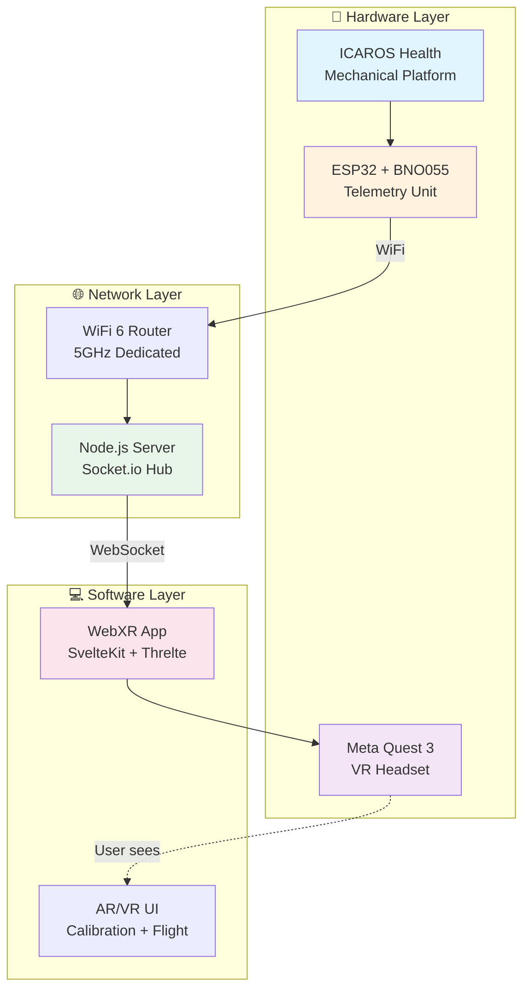
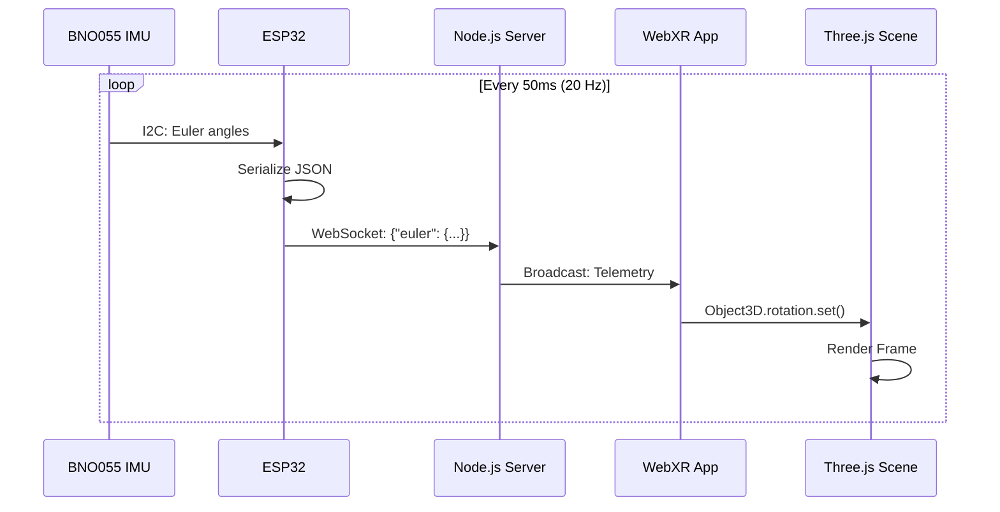
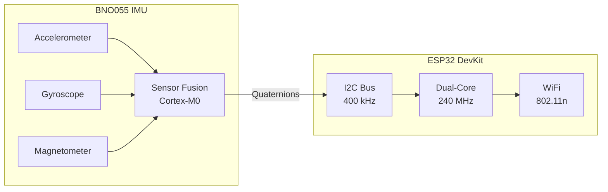
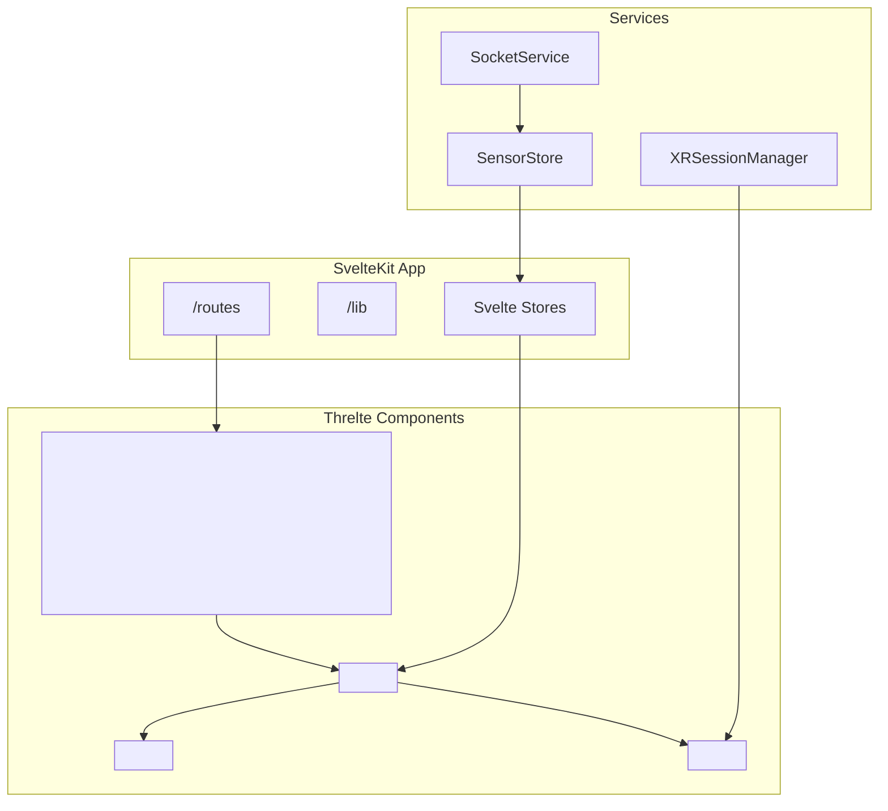
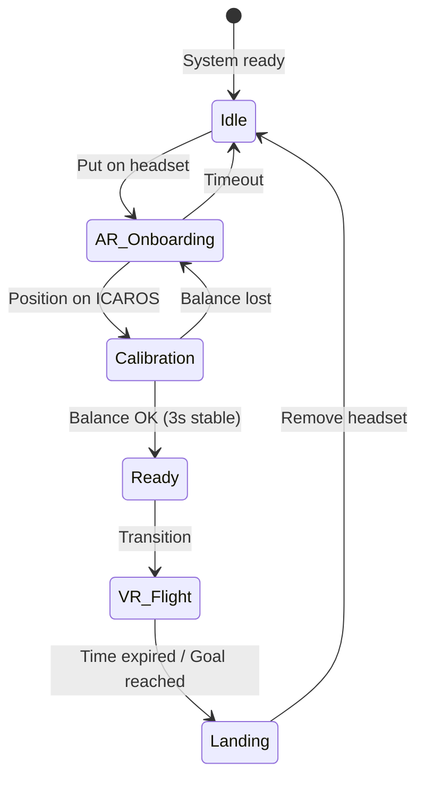
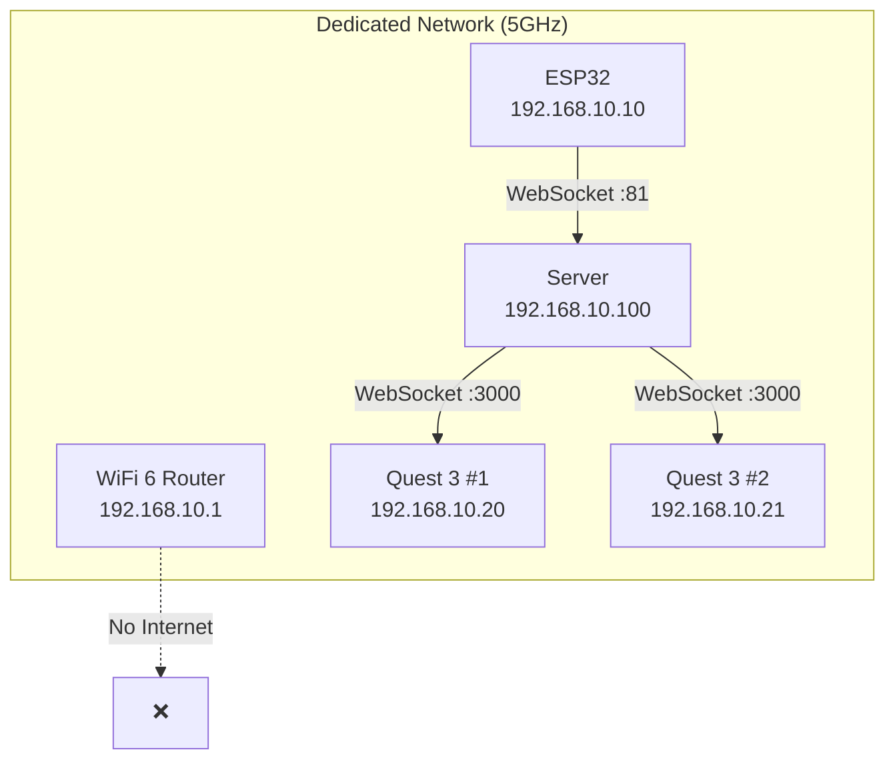

# PROJECT_STRUCTURE.md
## Icaros WebXR Integration – Master Document for Repository Setup

> **INSTRUCTIONS FOR CLAUDE CODE:**  
> This file is the central reference for the entire project. Read it completely before making any changes. Create all folders and files according to the structure defined below. Fill empty files with the specified content.

---

## 1. PROJECT CONTEXT

### 1.1 Overarching Project: Neural Flight

This repository is part of the **Neural Flight** project at Futurium Berlin:

- **Institution:** Futurium gGmbH, Berlin
- **Theme Year:** "Human + Technology" 2026
- **Opening:** September 2026
- **Project Lead:** David Weigend, Head of Futurium Lab

### 1.2 Vision

*Neural Flight* is an immersive VR installation on two ICAROS flight simulators. Visitors experience Body Ownership Illusion and Out-of-Body Experiences – the brain accepts virtual bodies as its own.

**Tagline:** "The body is just the beginning."

### 1.3 Technical Approach

- **No proprietary ICAROS system** – custom open-source infrastructure
- **WebXR-First** – URL-based distribution, no app stores
- **Self-Service Workflow** – AR onboarding without staff
- **Modular** – different university partners can develop their own "levels"

### 1.4 Reference Project

In 2019, the project "Being a Drone – Flying Architecture" was realized with TU Braunschweig (IMD, Dr. Philipp Reinfeld). Students developed VR applications and tested them during an intensive week at the Futurium.

---

## 2. FOLDER STRUCTURE

```
icaros-webxr-docs/
│
├── README.md                         # Project overview (see content below)
├── PROJEKT_STRUKTUR.md               # This file (master reference)
├── ROADMAP.md                        # Timeline & milestones
│
├── 01_hardware/
│   ├── HARDWARE_LIST.md              # Shopping list with links & prices
│   ├── ESP32_SETUP.md                # Pinout, configuration, troubleshooting
│   ├── BNO055_SENSOR.md              # IMU sensor details, calibration
│   ├── ICAROS_MOUNTING.md            # Physical mounting on the device
│   └── NETWORK_INFRASTRUCTURE.md     # Router, server, network topology
│
├── 02_software/
│   ├── SOFTWARE_REQUIREMENTS.md      # All dependencies & versions
│   ├── DEV_ENVIRONMENT_SETUP.md      # IDE, tools, plugin installation
│   ├── SVELTEKIT_WEBXR_GUIDE.md      # Frontend stack step-by-step
│   ├── THRELTE_SETUP.md              # Three.js + Svelte integration
│   ├── ESP32_ARDUINO_GUIDE.md        # Embedded development guide
│   └── WEBSOCKET_SERVER.md           # Node.js backend setup
│
├── 03_integration/
│   ├── SYSTEM_ARCHITECTURE.md        # Mermaid diagrams, data flow
│   ├── WEBSOCKET_PROTOCOL.md         # JSON schema for sensor data
│   ├── META_QUEST_WORKFLOW.md        # ADB, HTTPS, testing on Quest 3
│   └── AR_MR_FEATURES.md             # Passthrough, spatial anchors, RATK
│
├── 04_milestones/
│   ├── M1_SENSOR_PROTOTYPE.md        # ESP32 → Server communication
│   ├── M2_WEBXR_HELLO_WORLD.md       # Display cube in VR
│   ├── M3_SENSOR_TO_VR_BRIDGE.md     # Synchronize rotation
│   ├── M4_AR_CALIBRATION.md          # Passthrough + onboarding UI
│   └── M5_FLIGHT_PHYSICS.md          # Pitch/Roll → movement
│
├── 05_research/
│   ├── BODY_OWNERSHIP_ILLUSION.md    # Scientific background
│   ├── VESTIBULAR_SYSTEM.md          # Motion sickness, vection
│   └── RELATED_PROJECTS.md           # References, inspiration
│
├── 06_collaboration/
│   ├── UNI_PARTNERSHIPS.md           # Cooperation model for universities
│   └── CONTRIBUTION_GUIDE.md         # How new partners contribute
│
└── assets/
    ├── diagrams/                     # Mermaid source files (.mmd)
    │   ├── system_architecture.mmd
    │   ├── data_flow.mmd
    │   └── user_journey.mmd
    └── images/                       # Screenshots, photos
        └── .gitkeep
```

---

## 3. FILE CONTENTS

### 3.1 README.md

```markdown
# Icaros WebXR Integration

> Open-source infrastructure for immersive VR experiences on ICAROS flight simulators

## About This Project

Part of the **Neural Flight** installation at Futurium Berlin for the theme year "Human + Technology" 2026.

**Core Features:**
- WebXR-based VR application (no app store installation)
- ESP32 + BNO055 IMU for real-time motion data
- Self-service AR onboarding with Quest 3 Passthrough
- Decoupled gaze and flight direction (Decoupled Locomotion)

## Quick Links

| Document | Description |
|----------|-------------|
| [Hardware List](01_hardware/HARDWARE_LIST.md) | Shopping list with links |
| [Software Requirements](02_software/SOFTWARE_REQUIREMENTS.md) | Dependencies & versions |
| [System Architecture](03_integration/SYSTEM_ARCHITECTURE.md) | Technical overview |
| [Roadmap](ROADMAP.md) | Milestones & timeline |

## Tech Stack

| Layer | Technology |
|-------|------------|
| VR Runtime | WebXR + Three.js/Threlte |
| Frontend | SvelteKit + TypeScript |
| Backend | Node.js + Socket.io |
| Hardware | ESP32 + BNO055 IMU |
| Headset | Meta Quest 3 (Standalone) |

## Get Involved

This project is open for collaborations with universities. See [Cooperation Model](06_collaboration/UNI_PARTNERSHIPS.md).

## Contact

**David Weigend**  
Head of Lab, Futurium Berlin  
weigend@futurium.de

---

*Futurium gGmbH | Theme Year 2026: Human + Technology*
```

---

### 3.2 File Templates

For all other files, Claude Code should use the following template:

```markdown
# [FILENAME without .md]

> [Brief description in one sentence]

**Status:** 🔴 Draft | 🟡 In Progress | 🟢 Complete  
**Last Updated:** [DATE]

---

## Overview

[2-3 sentences of context]

## Prerequisites

- [ ] [Prerequisite 1]
- [ ] [Prerequisite 2]

## Content

### [Section 1]

[Content]

### [Section 2]

[Content]

## Troubleshooting

| Problem | Solution |
|---------|----------|
| [Problem 1] | [Solution 1] |

## References

- [Link 1](URL)
- [Link 2](URL)

---

*Part of the [Neural Flight](../README.md) project*
```

---

## 4. SPECIFIC CONTENT

### 4.1 HARDWARE_LIST.md – Fully Populated

```markdown
# Hardware Shopping List

> All components for the sensor prototype and development environment

**Status:** 🟢 Complete  
**Last Updated:** January 2026

---

## Core Components

| # | Component | Specification | Vendor | Link | Approx. Price |
|---|-----------|---------------|--------|------|---------------|
| 1 | **ESP32 DevKit V1** | NodeMCU, WROOM-32, 38 Pins | AZ-Delivery | [Link](https://www.az-delivery.de/products/esp32-developmentboard) | €10 |
| 2 | **Adafruit BNO055** | 9-DOF IMU, I2C, Sensor Fusion | BerryBase | [Link](https://www.berrybase.de/adafruit-9-dof-absolute-orientation-imu-fusion-breakout-bno055) | €35 |
| 3 | **Breadboard** | 830 contacts | AZ-Delivery | [Link](https://www.az-delivery.de/products/breadboard-830) | €5 |
| 4 | **Jumper Cable Set** | M-M, M-F, F-F, 40-pin | BerryBase | [Link](https://www.berrybase.de/40-pin-jumper-kabel-set-m-m-m-w-w-w) | €5 |
| 5 | **USB Power Bank** | 5V, 2A+, compact | Amazon | Any | €15 |

## Network Infrastructure

| # | Component | Specification | Vendor | Link | Approx. Price |
|---|-----------|---------------|--------|------|---------------|
| 6 | **WiFi 6 Router** | Dedicated, 5GHz, <20ms latency | Amazon | [TP-Link Archer AX23](https://www.amazon.de/dp/B09CDHNB4Q) | €50 |
| 7 | **Ethernet Cable** | Cat6, 2m | Amazon | Any | €5 |

## Development & Debugging

| # | Component | Specification | Vendor | Link | Approx. Price |
|---|-----------|---------------|--------|------|---------------|
| 8 | **USB-C Cable** | Quest 3 ADB, 3m | Amazon | AmazonBasics | €10 |
| 9 | **USB-A to Micro-USB** | ESP32 programming | Amazon | Any | €5 |

## Optional (Production)

| # | Component | Specification | Vendor | Link | Approx. Price |
|---|-----------|---------------|--------|------|---------------|
| 10 | **Raspberry Pi 5** | 8GB RAM, Server | BerryBase | [Link](https://www.berrybase.de/raspberry-pi-5) | €80 |
| 11 | **3D-Printed Enclosure** | Custom for ESP32+BNO055 | Self-made | - | ~€10 |
| 12 | **Cable Gland** | M12, waterproof | Conrad | Any | €5 |

---

## Total Costs

| Category | Total |
|----------|-------|
| Core Components | ~€70 |
| Network | ~€55 |
| Development | ~€15 |
| **Prototype Total** | **~€140** |
| + Production Optional | +€95 |

---

## German Vendors

| Vendor | Specialization | Delivery Time |
|--------|----------------|---------------|
| [AZ-Delivery](https://www.az-delivery.de) | ESP32, Arduino | 1-3 days |
| [BerryBase](https://www.berrybase.de) | Raspberry Pi, Adafruit | 1-3 days |
| [Reichelt](https://www.reichelt.de) | General electronics | 1-2 days |
| [Conrad](https://www.conrad.de) | Professional electronics | 1-2 days |
| [Eckstein-Shop](https://eckstein-shop.de) | Official Adafruit | 2-4 days |

---

## Notes

### BNO055 vs. MPU6050

We deliberately use the **BNO055** instead of the cheaper MPU6050:

| Property | BNO055 | MPU6050 |
|----------|--------|---------|
| Sensor Fusion | ✅ Onboard (Cortex-M0) | ❌ Software required |
| Output | Euler angles, Quaternions | Raw Accel/Gyro |
| Drift Correction | ✅ Automatic | ❌ Manual |
| Price | ~€35 | ~€5 |
| **VR Suitability** | ⭐⭐⭐⭐⭐ | ⭐⭐ |

For motion sickness prevention in VR, integrated sensor fusion is essential.

### ESP32 Variants

| Variant | Pins | Recommendation |
|---------|------|----------------|
| DevKit V1 (30 Pin) | 30 | ✅ Compact |
| DevKit V1 (38 Pin) | 38 | ✅ More GPIOs |
| ESP32-S3 | 44 | Overkill for this project |
| ESP32-C3 | 22 | ❌ Less performance |

---

*Part of the [Neural Flight](../README.md) project*
```

---

### 4.2 SOFTWARE_REQUIREMENTS.md – Fully Populated

```markdown
# Software Requirements

> All dependencies, tools, and versions for development

**Status:** 🟢 Complete  
**Last Updated:** January 2026

---

## Development Machine

### System Requirements

| Component | Minimum | Recommended |
|-----------|---------|-------------|
| OS | Windows 10 / macOS 12 / Ubuntu 22.04 | Ubuntu 24.04 |
| RAM | 8 GB | 16 GB |
| Storage | 20 GB free | SSD |
| GPU | Integrated | Dedicated (for local testing) |

### Base Tools

| Tool | Version | Installation | Purpose |
|------|---------|--------------|---------|
| **Node.js** | ≥20 LTS | [nodejs.org](https://nodejs.org) | SvelteKit Runtime |
| **pnpm** | ≥8.0 | `npm install -g pnpm` | Package Manager |
| **Git** | ≥2.40 | [git-scm.com](https://git-scm.com) | Version Control |
| **VS Code** | Latest | [code.visualstudio.com](https://code.visualstudio.com) | IDE |

### VS Code Extensions

| Extension | ID | Purpose |
|-----------|-----|---------|
| Svelte for VS Code | `svelte.svelte-vscode` | Svelte Syntax |
| PlatformIO IDE | `platformio.platformio-ide` | ESP32 Development |
| ESLint | `dbaeumer.vscode-eslint` | Linting |
| Prettier | `esbenp.prettier-vscode` | Formatting |
| Mermaid Editor | `tomoyukim.vscode-mermaid-editor` | Diagrams |

---

## Frontend Stack (WebXR App)

### package.json Dependencies

```json
{
  "name": "icaros-webxr",
  "version": "0.1.0",
  "type": "module",
  "scripts": {
    "dev": "vite dev --host",
    "dev:adb": "adb reverse tcp:5173 tcp:5173 && vite dev --host",
    "build": "vite build",
    "preview": "vite preview --host"
  },
  "dependencies": {
    "@sveltejs/kit": "^2.0.0",
    "@threlte/core": "^7.0.0",
    "@threlte/extras": "^8.0.0",
    "three": "^0.160.0",
    "socket.io-client": "^4.7.0"
  },
  "devDependencies": {
    "@sveltejs/adapter-node": "^2.0.0",
    "@types/three": "^0.160.0",
    "typescript": "^5.3.0",
    "vite": "^5.0.0",
    "vite-plugin-mkcert": "^1.17.0",
    "svelte": "^4.2.0",
    "svelte-check": "^3.6.0"
  }
}
```

### Optional WebXR Libraries

| Library | Version | Purpose | NPM |
|---------|---------|---------|-----|
| **RATK** | ^0.1 | Quest 3 MR Features | `ratk` |
| **three-mesh-ui** | ^7.0 | VR UI Components | `three-mesh-ui` |

---

## Backend Stack (WebSocket Server)

### Standalone Server (Production)

```json
{
  "name": "icaros-server",
  "version": "0.1.0",
  "type": "module",
  "dependencies": {
    "socket.io": "^4.7.0",
    "express": "^4.18.0"
  }
}
```

### Integrated in SvelteKit (Development)

For development, Socket.io can be integrated directly in SvelteKit via `@sveltejs/adapter-node`.

---

## Embedded Stack (ESP32)

### PlatformIO Configuration

```ini
; platformio.ini
[env:esp32dev]
platform = espressif32
board = esp32dev
framework = arduino
monitor_speed = 115200
lib_deps =
    adafruit/Adafruit BNO055@^1.6.3
    adafruit/Adafruit Unified Sensor@^1.1.14
    links2004/WebSockets@^2.4.1
    bblanchon/ArduinoJson@^7.0.0
```

### Arduino IDE Libraries

If using Arduino IDE instead of PlatformIO:

| Library | Version | Source |
|---------|---------|--------|
| Adafruit BNO055 | ^1.6.3 | Library Manager |
| Adafruit Unified Sensor | ^1.1.14 | Library Manager |
| WebSockets | ^2.4.1 | Library Manager |
| ArduinoJson | ^7.0.0 | Library Manager |

### ESP32 Board Package

```
Board Manager URL: https://raw.githubusercontent.com/espressif/arduino-esp32/gh-pages/package_esp32_index.json
Board: ESP32 Dev Module
```

---

## Quest 3 Development

### Android SDK / ADB

| Tool | Installation |
|------|--------------|
| **SideQuest** | [sidequestvr.com](https://sidequestvr.com) (includes ADB) |
| **ADB Standalone** | [developer.android.com](https://developer.android.com/tools/releases/platform-tools) |

### Quest Setup

1. Activate Developer Mode (Meta Developer Account)
2. Allow USB Debugging
3. `adb devices` → Quest should be listed

### Browser on Quest

| Browser | WebXR Support | Recommendation |
|---------|---------------|----------------|
| Meta Quest Browser | ✅ Full | ⭐ Primary |
| Wolvic | ✅ Full | Alternative |
| Firefox Reality | ⚠️ Discontinued | ❌ |

---

## Local HTTPS Certificates

WebXR requires HTTPS. For local development:

### Option 1: vite-plugin-mkcert (Recommended)

```bash
# Automatic via plugin
pnpm add -D vite-plugin-mkcert
```

```typescript
// vite.config.ts
import mkcert from 'vite-plugin-mkcert';

export default {
  plugins: [sveltekit(), mkcert()],
  server: { https: true, host: true }
};
```

### Option 2: mkcert CLI

```bash
# Installation
brew install mkcert  # macOS
choco install mkcert # Windows
apt install mkcert   # Ubuntu

# Create certificates
mkcert -install
mkcert localhost 127.0.0.1 ::1
```

---

## Version Matrix

| Component | Min Version | Tested With |
|-----------|-------------|-------------|
| Node.js | 18 LTS | 20 LTS |
| SvelteKit | 2.0 | 2.0 |
| Three.js | 0.150 | 0.160 |
| Socket.io | 4.5 | 4.7 |
| ESP32 Arduino Core | 2.0 | 2.0.14 |
| Quest OS | v57 | v62 |

---

## Troubleshooting

| Problem | Solution |
|---------|----------|
| `mkcert` certificate not accepted | Run `mkcert -install`, restart browser |
| Quest can't find localhost | `adb reverse tcp:5173 tcp:5173` |
| ESP32 not recognized | Install CP2102/CH340 driver |
| WebXR not available | Check HTTPS, use Quest Browser |

---

*Part of the [Neural Flight](../README.md) project*
```

---

### 4.3 SYSTEM_ARCHITECTURE.md – With Mermaid Diagrams

```markdown
# System Architecture

> Technical overview of the Icaros WebXR Integration

**Status:** 🟢 Complete  
**Last Updated:** January 2026

---

## Overview

The system consists of three main components that communicate via a local high-speed network.



---

## Data Flow

### Sensor → VR Pipeline



### Latency Budget

| Segment | Max Latency | Typical |
|---------|-------------|---------|
| BNO055 → ESP32 (I2C) | 1ms | <1ms |
| ESP32 Processing | 2ms | 1ms |
| WiFi Transmission | 5ms | 2ms |
| Server Processing | 2ms | 1ms |
| WebSocket → Browser | 5ms | 2ms |
| Three.js Render | 5ms | 3ms |
| **Total** | **20ms** | **<10ms** |

---

## Component Details

### A. Telemetry Unit (ESP32 + BNO055)



**Pinout:**

| ESP32 Pin | BNO055 Pin | Function |
|-----------|------------|----------|
| 3V3 | VIN | Power Supply |
| GND | GND | Ground |
| GPIO 21 | SDA | I2C Data |
| GPIO 22 | SCL | I2C Clock |

### B. WebSocket Protocol

**JSON Schema for Telemetry:**

```json
{
  "type": "telemetry",
  "timestamp": 1704067200000,
  "euler": {
    "x": 0.0,
    "y": 0.0,
    "z": 0.0
  },
  "quaternion": {
    "w": 1.0,
    "x": 0.0,
    "y": 0.0,
    "z": 0.0
  },
  "calibration": {
    "sys": 3,
    "gyro": 3,
    "accel": 3,
    "mag": 3
  }
}
```

**Server → Client Events:**

| Event | Payload | Description |
|-------|---------|-------------|
| `telemetry` | See above | Sensor data |
| `calibration_status` | `{ready: boolean}` | Calibration OK |
| `session_start` | `{mode: "ar"|"vr"}` | Experience starts |
| `session_end` | `{}` | Experience ends |

### C. WebXR App Architecture



---

## User Journey (Phases)



### Phase Details

| Phase | Duration | Description |
|-------|----------|-------------|
| **Idle** | - | System waiting, Attract Mode |
| **AR Onboarding** | ~30s | Passthrough + Ghost Model Overlay |
| **Calibration** | ~10s | Level UI, Balance Check |
| **Ready** | ~3s | Countdown, Transition Preparation |
| **VR Flight** | 2-5 min | Immersive Flight Experience |
| **Landing** | ~10s | Fade back to Passthrough |

---

## Network Topology



**Why a dedicated network?**

- Exhibition WiFi often overloaded
- Guaranteed latency <20ms
- No interference with visitors
- Easier debugging

---

## Safety Aspects

### Software Limits

| Parameter | Value | Reason |
|-----------|-------|--------|
| Max Pitch | ±45° | Prevents rollover |
| Max Roll | ±30° | Lateral stability |
| Session Timeout | 5 min | Queue management |
| Idle Timeout | 60s | Auto-reset on inactivity |

### Hardware Safety

- Sensor enclosure with cable gland
- USB power bank instead of power adapter (no cables on floor)
- Quest 3 with hand strap

---

*Part of the [Neural Flight](../README.md) project*
```

---

## 5. INSTRUCTIONS FOR CLAUDE CODE

### 5.1 Initialize Repository

```bash
# Execute in target directory
git init icaros-webxr-docs
cd icaros-webxr-docs
```

### 5.2 Create Folder Structure

Create all folders according to Section 2. Empty folders need a `.gitkeep` file.

### 5.3 Create Files

1. **Fill immediately and completely:**
   - README.md (Section 3.1)
   - 01_hardware/HARDWARE_LIST.md (Section 4.1)
   - 02_software/SOFTWARE_REQUIREMENTS.md (Section 4.2)
   - 03_integration/SYSTEM_ARCHITECTURE.md (Section 4.3)

2. **Create with template (Section 3.2):**
   - All other .md files

### 5.4 Mermaid Diagrams

Extract the Mermaid code blocks from SYSTEM_ARCHITECTURE.md and additionally save them as separate `.mmd` files in `assets/diagrams/`.

### 5.5 Git Commit

```bash
git add .
git commit -m "Initial documentation structure for Icaros WebXR project"
```

---

## 6. MAINTENANCE & UPDATES

This file is the central reference. For changes:

1. First update PROJEKT_STRUKTUR.md
2. Then adjust affected individual files
3. Commit with clear description

**Versioning:**

| Version | Date | Change |
|---------|------|--------|
| 0.1 | Jan 2026 | Initial Draft |

---

*Futurium gGmbH | Neural Flight | Theme Year 2026: Human + Technology*
