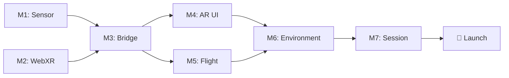

# Roadmap

> Meilensteine und Zeitplan für die Icaros WebXR Integration

**Status:** 🟢 Active  
**Zuletzt aktualisiert:** Januar 2026

---

## Übersicht

```
2025 Q4          2026 Q1          2026 Q2          2026 Q3          2026 Q4
────────────────────────────────────────────────────────────────────────────
   │                │                │                │                │
   ▼                ▼                ▼                ▼                ▼
┌──────┐      ┌──────────┐    ┌────────────┐   ┌──────────┐    ┌─────────┐
│Konzept│ ──▶ │Prototyping│──▶│ Development │──▶│  Testing  │──▶│ Launch  │
└──────┘      └──────────┘    └────────────┘   └──────────┘    └─────────┘
   ✅              🔄               ⏳               ⏳              🎯
```

---

## Phase 0: Recherche (Q4 2025 – Q1 2026)

### R1: Sensor & Hardware-Recherche ✅
**Zeitraum:** KW 1 (Januar 2026)
**Status:** Abgeschlossen

| Task | Beschreibung | Status |
|------|--------------|--------|
| Problemstellung definieren | Was messen wir? Welche Anforderungen? | ✅ |
| Sensortypen vergleichen | IMU vs. optisches Tracking | ✅ |
| Sensor-Vergleich | BNO055 vs BNO085 vs ICM-20948 vs MPU6050 | ✅ |
| Protokolle evaluieren | WebSocket vs OSC vs MQTT | ✅ |
| Datenformate | Quaternionen für Three.js/Godot/Unity | ✅ |
| DIY-Projekte sammeln | SlimeVR, XSimulator, GitHub-Projekte | ✅ |
| Bezugsquellen | Deutsche Händler (Berrybase, AZ-Delivery) | ✅ |

**Ergebnis:** [docs/hardware/SENSOR_RESEARCH.md](hardware/SENSOR_RESEARCH.md)

---

### R2: WebXR & Software-Recherche ⏳
**Zeitraum:** KW 2 (Januar 2026)
**Status:** Geplant

| Task | Beschreibung | Status |
|------|--------------|--------|
| WebXR-Frameworks | Threlte vs. A-Frame vs. native Three.js | ⏳ |
| Quest 3 Workflow | ADB, HTTPS, Developer Mode | ⏳ |
| AR/MR Features | Passthrough, RATK | ⏳ |

---

## Phase 1: Prototyping (Q1 2026)

### M1: Sensor-Prototyp 🔄
**Zeitraum:** KW 2-3 (Januar 2026)
**Status:** Bereit zum Start

**Ziel:** ESP32 + Sensor senden stabile Orientierungsdaten per WebSocket

| Task | Beschreibung | Status |
|------|--------------|--------|
| Hardware bestellen | ESP32 + BNO055 oder ICM-20948 | ⏳ |
| I2C-Verbindung testen | Arduino Serial Monitor, Quaternion-Output | ⏳ |
| WiFi-Konfiguration | Verbindung zu dediziertem Router | ⏳ |
| WebSocket-Server | Node.js Server empfängt Telemetrie | ⏳ |
| JSON-Protokoll | Quaternion + Euler + Calibration | ⏳ |

**Erfolgskriterium:**
Sensor in Hand bewegen → Werte in Browser-Console sichtbar

**Dokumentation:**
- [M1_SENSOR_PROTOTYPE.md](milestones/M1_SENSOR_PROTOTYPE.md)
- [SENSOR_RESEARCH.md](hardware/SENSOR_RESEARCH.md)

---

### M2: WebXR Hello World ⏳
**Zeitraum:** KW 2-3 (Januar 2026)  
**Status:** Geplant

**Ziel:** 3D-Würfel in VR auf Meta Quest 3 anzeigen

| Task | Beschreibung | Status |
|------|--------------|--------|
| SvelteKit Projekt | `pnpm create svelte@latest` | ⏳ |
| Threlte Integration | Three.js + Svelte Setup | ⏳ |
| HTTPS Zertifikate | `vite-plugin-mkcert` | ⏳ |
| ADB Reverse Tunnel | `adb reverse tcp:5173 tcp:5173` | ⏳ |
| WebXR Session | VR Button, Immersive Session | ⏳ |
| Quest Browser Test | `https://localhost:5173` | ⏳ |

**Erfolgskriterium:**  
Cube in VR sichtbar, Head-Tracking funktioniert

**Dokumentation:**  
- [M2_WEBXR_HELLO_WORLD.md](04_milestones/M2_WEBXR_HELLO_WORLD.md)
- [SVELTEKIT_WEBXR_GUIDE.md](02_software/SVELTEKIT_WEBXR_GUIDE.md)
- [META_QUEST_WORKFLOW.md](03_integration/META_QUEST_WORKFLOW.md)

---

### M3: Sensor-to-VR Bridge ⏳
**Zeitraum:** KW 3-4 (Januar/Februar 2026)  
**Status:** Geplant

**Ziel:** VR-Objekt rotiert synchron zur Sensor-Bewegung

| Task | Beschreibung | Status |
|------|--------------|--------|
| Socket.io Client | Integration in SvelteKit | ⏳ |
| Svelte Store | Reaktive Sensor-Daten | ⏳ |
| Three.js Binding | `object.rotation.set(euler)` | ⏳ |
| Smoothing | Lerping für flüssige Animation | ⏳ |
| Latenz-Messung | Ziel: <20ms End-to-End | ⏳ |

**Erfolgskriterium:**  
Sensor in Hand = Cube in VR rotiert identisch, flüssig, ohne Lag

**Dokumentation:**  
- [M3_SENSOR_TO_VR_BRIDGE.md](04_milestones/M3_SENSOR_TO_VR_BRIDGE.md)
- [WEBSOCKET_PROTOCOL.md](03_integration/WEBSOCKET_PROTOCOL.md)

---

### M4: AR Calibration UI ⏳
**Zeitraum:** KW 4-6 (Februar 2026)  
**Status:** Geplant

**Ziel:** Quest 3 Passthrough mit Balance-Check UI

| Task | Beschreibung | Status |
|------|--------------|--------|
| Passthrough aktivieren | RATK oder native WebXR | ⏳ |
| Ghost Model Overlay | ICAROS 3D-Wireframe | ⏳ |
| Wasserwaage HUD | Pitch/Roll Visualisierung | ⏳ |
| Balance Detection | ±3° für 2-3 Sekunden | ⏳ |
| Audio Feedback | "System kalibriert" | ⏳ |
| Transition | AR → VR Crossfade | ⏳ |

**Erfolgskriterium:**  
Nutzer sieht realen ICAROS + Overlay, System erkennt stabile Position

**Dokumentation:**  
- [M4_AR_CALIBRATION.md](04_milestones/M4_AR_CALIBRATION.md)
- [AR_MR_FEATURES.md](03_integration/AR_MR_FEATURES.md)

---

## Phase 2: Development (Q2 2026)

### M5: Flight Physics ⏳
**Zeitraum:** KW 7-10 (Februar/März 2026)  
**Status:** Geplant

**Ziel:** Implementierung des Flugmodells

| Task | Beschreibung | Status |
|------|--------------|--------|
| Pitch → Geschwindigkeit | Vorwärts/Rückwärts | ⏳ |
| Roll → Kurve | Links/Rechts | ⏳ |
| Decoupled View | Blick ≠ Flugrichtung | ⏳ |
| Speed Limits | Soft Caps, Comfort | ⏳ |
| Smoothing | Acceleration Curves | ⏳ |

**Dokumentation:**  
- [M5_FLIGHT_PHYSICS.md](04_milestones/M5_FLIGHT_PHYSICS.md)

---

### M6: Environment & Skybox ⏳
**Zeitraum:** KW 11-14 (März/April 2026)  
**Status:** Geplant

| Task | Beschreibung |
|------|--------------|
| Skybox System | HDR, dynamisch |
| Terrain | Low-poly oder prozedural |
| Landmarks | Orientierungspunkte |
| Audio Ambience | Spatial Audio |

---

### M7: Session Management ⏳
**Zeitraum:** KW 15-18 (April/Mai 2026)  
**Status:** Geplant

| Task | Beschreibung |
|------|--------------|
| Session Timer | 2-5 Minuten |
| Auto-Reset | Idle Detection |
| Landing Sequence | Sanfter Rückführung |
| Kiosk Mode | Autonomer Betrieb |

---

## Phase 3: Testing (Q3 2026)

### Intern Testing ⏳
**Zeitraum:** KW 19-24 (Mai/Juni 2026)

- Lab-Team Testings
- Iteration basierend auf Feedback
- Performance Optimization
- Bug Fixing

### Public Beta ⏳
**Zeitraum:** KW 25-30 (Juni/Juli 2026)

- Eingeschränkte Öffnung für Besucher
- Feedback Collection
- UX Refinement

### Final Polish ⏳
**Zeitraum:** KW 31-35 (August 2026)

- Letzte Anpassungen
- Dokumentation finalisieren
- Training für Futurium-Team

---

## Phase 4: Launch (September 2026)

### 🎯 Eröffnung
**Datum:** September 2026 (genauer Termin TBD)

- Soft Opening mit ausgewählten Gästen
- Presse-Event
- Public Opening

---

## Abhängigkeiten



---

## Risiken & Mitigationen

| Risiko | Wahrscheinlichkeit | Impact | Mitigation |
|--------|-------------------|--------|------------|
| Quest 3 WebXR Bugs | Mittel | Hoch | Fallback auf native App |
| Latenz >20ms | Niedrig | Hoch | Dediziertes Netzwerk |
| BNO055 Drift | Niedrig | Mittel | Regelmäßige Kalibrierung |
| Uni-Partner Ausfall | Mittel | Mittel | Modulare Architektur |

---

## Ressourcen

### Budget (geschätzt)

| Kategorie | Betrag |
|-----------|--------|
| Hardware Prototyping | ~500€ |
| Hardware Production | ~2.000€ |
| Software/Lizenzen | ~0€ (Open Source) |
| Uni-Kooperationen | Variable |

### Team-Bedarf

| Phase | FTE |
|-------|-----|
| Prototyping | 0.5 |
| Development | 1.0 |
| Testing | 0.5 |

---

## Changelog

| Datum | Version | Änderung |
|-------|---------|----------|
| 2026-01-05 | 0.1 | Initial Roadmap |

---

*Teil des [Neural Flight](README.md) Projekts | Futurium gGmbH*
