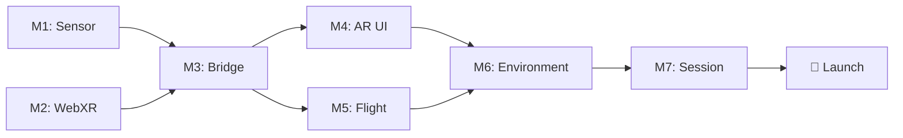

# Roadmap

> Milestones and timeline for the Icaros WebXR Integration

**Status:** 🟢 Active  
**Last Updated:** January 2026

---

## Overview

```
2025 Q4          2026 Q1          2026 Q2          2026 Q3          2026 Q4
────────────────────────────────────────────────────────────────────────────
   │                │                │                │                │
   ▼                ▼                ▼                ▼                ▼
┌──────┐      ┌──────────┐    ┌────────────┐   ┌──────────┐    ┌─────────┐
│Concept│ ──▶ │Prototyping│──▶│ Development │──▶│  Testing  │──▶│ Launch  │
└──────┘      └──────────┘    └────────────┘   └──────────┘    └─────────┘
   ✅              🔄               ⏳               ⏳              🎯
```

---

## Phase 0: Research (Q4 2025 – Q1 2026)

### R1: Sensor & Hardware Research ✅
**Timeframe:** Week 1 (January 2026)
**Status:** Completed

| Task | Description | Status |
|------|-------------|--------|
| Define problem statement | What are we measuring? What are the requirements? | ✅ |
| Compare sensor types | IMU vs. optical tracking | ✅ |
| Sensor comparison | BNO055 vs BNO085 vs ICM-20948 vs MPU6050 | ✅ |
| Evaluate protocols | WebSocket vs OSC vs MQTT | ✅ |
| Data formats | Quaternions for Three.js/Godot/Unity | ✅ |
| Collect DIY projects | SlimeVR, XSimulator, GitHub projects | ✅ |
| Vendors | German retailers (Berrybase, AZ-Delivery) | ✅ |

**Result:** [docs/hardware/SENSOR_RESEARCH.md](hardware/SENSOR_RESEARCH.md)

---

### R2: WebXR & Software Research ✅
**Timeframe:** Week 2 (January 2026)
**Status:** Completed

| Task | Description | Status |
|------|-------------|--------|
| WebXR frameworks | Vanilla Three.js as base, framework options documented | ✅ |
| Quest 3 workflow | ADB, HTTPS (mkcert), Developer Mode, Remote Debugging | ✅ |
| AR/MR features | Passthrough, Spatial Anchors, Hit-Testing, RATK | ✅ |

**Results:**
- [THREEJS_WEBXR_GUIDE.md](software/THREEJS_WEBXR_GUIDE.md) – Native Three.js + WebXR
- [FRAMEWORK_OPTIONS.md](software/FRAMEWORK_OPTIONS.md) – Options for teams
- [META_QUEST_WORKFLOW.md](integration/META_QUEST_WORKFLOW.md) – Quest 3 Dev Workflow
- [AR_MR_FEATURES.md](integration/AR_MR_FEATURES.md) – Passthrough & MR

**Key Decision:** Vanilla Three.js as platform base (framework-agnostic for teams)

---

## Phase 1: Prototyping (Q1 2026)

### M1: Sensor Prototype 🔄
**Timeframe:** Weeks 2-3 (January 2026)
**Status:** Ready to Start

**Goal:** ESP32 + Sensor sends stable orientation data via WebSocket

| Task | Description | Status |
|------|-------------|--------|
| Order hardware | ESP32 + BNO055 or ICM-20948 | ⏳ |
| Test I2C connection | Arduino Serial Monitor, Quaternion output | ⏳ |
| WiFi configuration | Connection to dedicated router | ⏳ |
| WebSocket server | Node.js server receives telemetry | ⏳ |
| JSON protocol | Quaternion + Euler + Calibration | ⏳ |

**Success Criterion:**
Move sensor in hand → Values visible in browser console

**Documentation:**
- [M1_SENSOR_PROTOTYPE.md](milestones/M1_SENSOR_PROTOTYPE.md)
- [SENSOR_RESEARCH.md](hardware/SENSOR_RESEARCH.md)

---

### M2: WebXR Hello World ⏳
**Timeframe:** Weeks 2-3 (January 2026)
**Status:** Planned

**Goal:** Display 3D cube in VR on Meta Quest 3

| Task | Description | Status |
|------|-------------|--------|
| Vanilla Three.js | Minimal HTML + Three.js setup | ⏳ |
| HTTPS certificates | mkcert for local development | ⏳ |
| ADB reverse tunnel | `adb reverse tcp:5173 tcp:5173` | ⏳ |
| WebXR session | VRButton, `renderer.xr.enabled = true` | ⏳ |
| Quest Browser test | `https://localhost:5173` | ⏳ |

**Success Criterion:**
Cube visible in VR, head tracking works

**Documentation:**
- [M2_WEBXR_HELLO_WORLD.md](milestones/M2_WEBXR_HELLO_WORLD.md)
- [THREEJS_WEBXR_GUIDE.md](software/THREEJS_WEBXR_GUIDE.md)
- [META_QUEST_WORKFLOW.md](integration/META_QUEST_WORKFLOW.md)

---

### M3: Sensor-to-VR Bridge ⏳
**Timeframe:** Weeks 3-4 (January/February 2026)  
**Status:** Planned

**Goal:** VR object rotates synchronously with sensor movement

| Task | Description | Status |
|------|-------------|--------|
| Socket.io client | Integration in SvelteKit | ⏳ |
| Svelte store | Reactive sensor data | ⏳ |
| Three.js binding | `object.rotation.set(euler)` | ⏳ |
| Smoothing | Lerping for smooth animation | ⏳ |
| Latency measurement | Target: <20ms end-to-end | ⏳ |

**Success Criterion:**  
Sensor in hand = Cube in VR rotates identically, smoothly, without lag

**Documentation:**  
- [M3_SENSOR_TO_VR_BRIDGE.md](04_milestones/M3_SENSOR_TO_VR_BRIDGE.md)
- [WEBSOCKET_PROTOCOL.md](03_integration/WEBSOCKET_PROTOCOL.md)

---

### M4: AR Calibration UI ⏳
**Timeframe:** Weeks 4-6 (February 2026)  
**Status:** Planned

**Goal:** Quest 3 Passthrough with balance check UI

| Task | Description | Status |
|------|-------------|--------|
| Activate passthrough | RATK or native WebXR | ⏳ |
| Ghost model overlay | ICAROS 3D wireframe | ⏳ |
| Level HUD | Pitch/Roll visualization | ⏳ |
| Balance detection | ±3° for 2-3 seconds | ⏳ |
| Audio feedback | "System calibrated" | ⏳ |
| Transition | AR → VR crossfade | ⏳ |

**Success Criterion:**  
User sees real ICAROS + overlay, system detects stable position

**Documentation:**  
- [M4_AR_CALIBRATION.md](04_milestones/M4_AR_CALIBRATION.md)
- [AR_MR_FEATURES.md](03_integration/AR_MR_FEATURES.md)

---

## Phase 2: Development (Q2 2026)

### M5: Flight Physics ⏳
**Timeframe:** Weeks 7-10 (February/March 2026)  
**Status:** Planned

**Goal:** Implement flight model

| Task | Description | Status |
|------|-------------|--------|
| Pitch → Speed | Forward/Backward | ⏳ |
| Roll → Turn | Left/Right | ⏳ |
| Decoupled view | Gaze ≠ Flight direction | ⏳ |
| Speed limits | Soft caps, comfort | ⏳ |
| Smoothing | Acceleration curves | ⏳ |

**Documentation:**  
- [M5_FLIGHT_PHYSICS.md](04_milestones/M5_FLIGHT_PHYSICS.md)

---

### M6: Environment & Skybox ⏳
**Timeframe:** Weeks 11-14 (March/April 2026)  
**Status:** Planned

| Task | Description |
|------|-------------|
| Skybox system | HDR, dynamic |
| Terrain | Low-poly or procedural |
| Landmarks | Orientation points |
| Audio ambience | Spatial audio |

---

### M7: Session Management ⏳
**Timeframe:** Weeks 15-18 (April/May 2026)  
**Status:** Planned

| Task | Description |
|------|-------------|
| Session timer | 2-5 minutes |
| Auto-reset | Idle detection |
| Landing sequence | Smooth return |
| Kiosk mode | Autonomous operation |

---

## Phase 3: Testing (Q3 2026)

### Internal Testing ⏳
**Timeframe:** Weeks 19-24 (May/June 2026)

- Lab team testing
- Iteration based on feedback
- Performance optimization
- Bug fixing

### Public Beta ⏳
**Timeframe:** Weeks 25-30 (June/July 2026)

- Limited opening for visitors
- Feedback collection
- UX refinement

### Final Polish ⏳
**Timeframe:** Weeks 31-35 (August 2026)

- Final adjustments
- Finalize documentation
- Training for Futurium team

---

## Phase 4: Launch (September 2026)

### 🎯 Opening
**Date:** September 2026 (exact date TBD)

- Soft opening with selected guests
- Press event
- Public opening

---

## Dependencies



---

## Risks & Mitigations

| Risk | Probability | Impact | Mitigation |
|------|-------------|--------|------------|
| Quest 3 WebXR bugs | Medium | High | Fallback to native app |
| Latency >20ms | Low | High | Dedicated network |
| BNO055 drift | Low | Medium | Regular calibration |
| University partner dropout | Medium | Medium | Modular architecture |

---

## Resources

### Budget (estimated)

| Category | Amount |
|----------|--------|
| Hardware prototyping | ~€500 |
| Hardware production | ~€2,000 |
| Software/licenses | ~€0 (Open Source) |
| University collaborations | Variable |

### Team Requirements

| Phase | FTE |
|-------|-----|
| Prototyping | 0.5 |
| Development | 1.0 |
| Testing | 0.5 |

---

## Changelog

| Date | Version | Change |
|------|---------|--------|
| 2026-01-05 | 0.2 | R2 completed, Vanilla Three.js as base |
| 2026-01-05 | 0.1 | Initial Roadmap |

---

*Part of the [Neural Flight](README.md) project | Futurium gGmbH*
