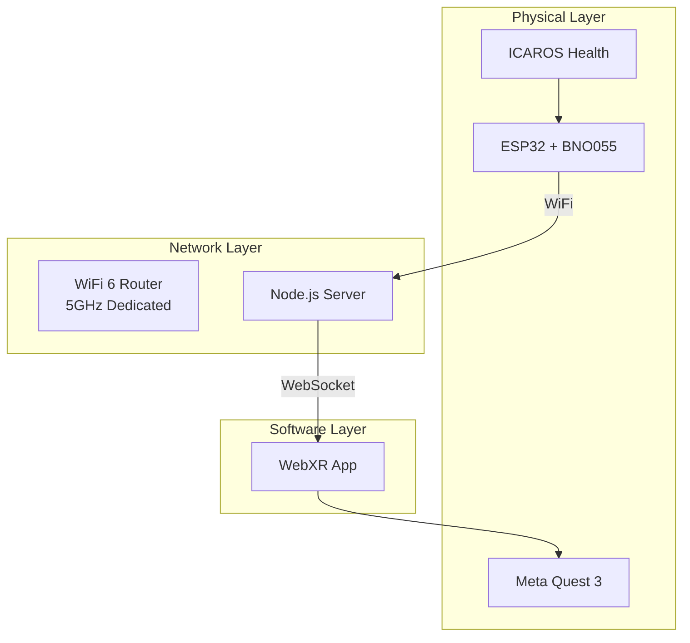
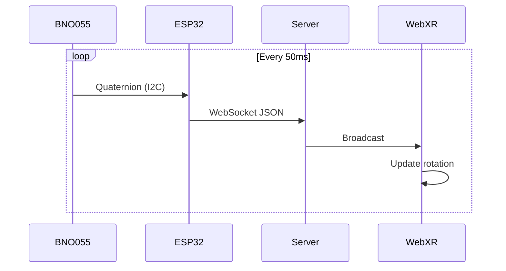
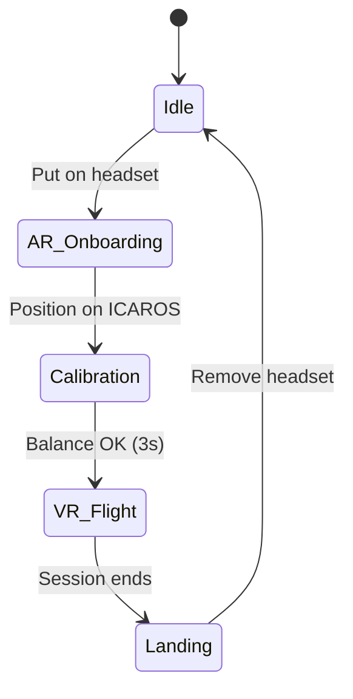

# System Architecture

> Technical overview of the Icaros WebXR Integration

**Status:** 🟢 Complete  
**Last Updated:** January 2026

---

## Overview

The system connects physical movement on the ICAROS with immersive VR experiences. Architecture is intentionally simple: open-source components, web standards, minimal dependencies.



---

## Data Flow

### Sensor → VR Pipeline



### Latency Budget

| Segment | Target | Typical |
|---------|--------|---------|
| IMU → ESP32 | 1ms | <1ms |
| WiFi TX | 5ms | 2ms |
| Server | 2ms | 1ms |
| WebSocket → Browser | 5ms | 2ms |
| **Total** | **<20ms** | **<10ms** |

---

## Components

### Telemetry Unit (ESP32 + BNO055)

| ESP32 Pin | BNO055 | Signal |
|-----------|--------|--------|
| 3V3 | VIN | Power |
| GND | GND | Ground |
| GPIO 21 | SDA | I2C Data |
| GPIO 22 | SCL | I2C Clock |

### WebSocket Protocol

```json
{
  "type": "telemetry",
  "timestamp": 1704067200000,
  "quaternion": { "w": 1.0, "x": 0.0, "y": 0.0, "z": 0.0 },
  "calibration": { "sys": 3, "gyro": 3, "accel": 3, "mag": 3 }
}
```

---

## Network Topology

```
SSID: ICAROS-Lab (5GHz, hidden)
Subnet: 192.168.10.0/24

Devices:
- Router:   192.168.10.1
- ESP32:    192.168.10.10
- Quest:    192.168.10.20
- Server:   192.168.10.100
```

**Why dedicated network?**
- Exhibition WiFi often overloaded
- Guaranteed <20ms latency
- No interference with visitors

---

## User Journey



| Phase | Duration | Description |
|-------|----------|-------------|
| Idle | - | Attract mode |
| AR Onboarding | ~30s | Passthrough + instructions |
| Calibration | ~10s | Level UI, balance check |
| VR Flight | 2-5 min | Immersive experience |
| Landing | ~10s | Fade to passthrough |

---

## Safety Limits

| Parameter | Value | Reason |
|-----------|-------|--------|
| Max Pitch | ±45° | Prevent rollover feeling |
| Max Roll | ±30° | Lateral stability |
| Session Timeout | 5 min | Queue management |
| Idle Timeout | 60s | Auto-reset |

---

## References

- [WebXR Device API](https://developer.mozilla.org/en-US/docs/Web/API/WebXR_Device_API)
- [Socket.io Docs](https://socket.io/docs/v4/)
- [Adafruit BNO055 Guide](https://learn.adafruit.com/adafruit-bno055-absolute-orientation-sensor)

---

*Part of the [Neural Flight](../README.md) project*
