# System-Architektur

> Technische Übersicht der Icaros WebXR Integration

**Status:** 🟢 Complete  
**Zuletzt aktualisiert:** Januar 2026

---

## Übersicht

Das System verbindet physische Bewegung auf dem ICAROS mit immersiven VR-Erfahrungen. Die Architektur ist bewusst einfach gehalten: Open-Source-Komponenten, Web-Standards, minimale Abhängigkeiten.

---

## High-Level Architektur

```mermaid
graph TB
    subgraph Physical["🔧 Physical Layer"]
        ICAROS[ICAROS Health<br/>Mechanische Plattform]
        ESP[ESP32 + BNO055<br/>Telemetrie-Unit]
        QUEST[Meta Quest 3<br/>VR Headset]
    end
    
    subgraph Network["🌐 Network Layer"]
        ROUTER[WiFi 6 Router<br/>5GHz Dediziert]
        SERVER[Node.js Server<br/>Socket.io Hub]
    end
    
    subgraph Software["💻 Software Layer"]
        WEBXR[WebXR App<br/>SvelteKit + Threlte]
        SCENES[VR Scenes<br/>Three.js]
    end
    
    ICAROS -->|"Nutzer bewegt"| ESP
    ESP -->|"WiFi 5GHz"| ROUTER
    ROUTER --> SERVER
    SERVER -->|"WebSocket"| WEBXR
    WEBXR --> SCENES
    SCENES -->|"Rendered in"| QUEST
    QUEST -.->|"Nutzer trägt"| ICAROS
    
    style ICAROS fill:#e3f2fd,stroke:#1976d2
    style ESP fill:#fff3e0,stroke:#f57c00
    style QUEST fill:#f3e5f5,stroke:#7b1fa2
    style SERVER fill:#e8f5e9,stroke:#388e3c
    style WEBXR fill:#fce4ec,stroke:#c2185b
```



---

## Datenfluss

### Sensor → VR Pipeline (20 Hz)


### Latenz-Budget

| Segment | Max | Typisch | Optimierung |
|---------|-----|---------|-------------|
| BNO055 → ESP32 (I2C @ 400kHz) | 1ms | <1ms | - |
| ESP32 JSON Serialization | 2ms | 1ms | ArduinoJson |
| WiFi TX (5GHz) | 5ms | 2ms | Dediziertes Netzwerk |
| Server Processing | 2ms | 1ms | Keine DB, pure Broadcast |
| WebSocket → Browser | 5ms | 2ms | Socket.io Binary |
| Svelte Store → Three.js | 1ms | <1ms | Direkte Bindung |
| **Total Motion-to-Photon** | **<20ms** | **<10ms** | ✅ VR-tauglich |

**Ziel:** <20ms End-to-End Latenz für komfortable VR-Erfahrung ohne Motion Sickness.

---

## Komponenten-Details

### A. Telemetrie-Unit (ESP32 + BNO055)

```mermaid
graph LR
    subgraph BNO055["BNO055 9-DOF IMU"]
        ACCEL[Accelerometer<br/>±16g]
        GYRO[Gyroscope<br/>±2000°/s]
        MAG[Magnetometer<br/>±1300µT]
        FUSION[Sensor Fusion<br/>ARM Cortex-M0]
    end
    
    subgraph ESP32["ESP32 WROOM-32"]
        I2C[I2C Bus<br/>400 kHz]
        CPU[Dual-Core<br/>240 MHz]
        WIFI[WiFi<br/>802.11n]
        WS[WebSocket<br/>Client]
    end
    
    ACCEL --> FUSION
    GYRO --> FUSION
    MAG --> FUSION
    FUSION -->|"Quaternions<br/>Euler-Winkel"| I2C
    I2C --> CPU
    CPU --> WS
    WS --> WIFI
```



**I2C Pinout:**

| ESP32 | BNO055 | Signal |
|-------|--------|--------|
| 3V3 | VIN | Power |
| GND | GND | Ground |
| GPIO 21 | SDA | I2C Data |
| GPIO 22 | SCL | I2C Clock |

**BNO055 Output-Modi:**

| Modus | Daten | Update Rate |
|-------|-------|-------------|
| **Euler** | Heading, Roll, Pitch | 100 Hz |
| **Quaternion** | w, x, y, z | 100 Hz |
| **Linear Accel** | ohne Gravitation | 100 Hz |
| **Gravity Vector** | Richtung der Schwerkraft | 100 Hz |

Wir verwenden primär **Quaternions** (präziser, kein Gimbal Lock) und konvertieren zu Euler für Debugging.

---

### B. WebSocket Server (Node.js)


**Server-Architektur:**

- **Keine Datenbank** – Stateless, pure Message Routing
- **Socket.io Rooms** – Trennung von Sensor-, VR- und Admin-Clients
- **Binary Fallback** – WebSocket mit JSON, Binary für Low-Latency

**Events:**

| Event | Richtung | Payload |
|-------|----------|---------|
| `telemetry` | ESP → Server → Quest | Sensor-Daten |
| `calibration` | Server → Quest | Kalibrierungsstatus |
| `session:start` | Server → Quest | AR→VR Transition |
| `session:end` | Server → Quest | VR→AR Transition |

---

### C. WebXR Frontend (SvelteKit + Threlte)


**Svelte Store für Sensor-Daten:**

```typescript
// src/lib/stores/sensorStore.ts
import { writable, derived } from 'svelte/store';
import type { Euler, Quaternion } from 'three';

interface SensorData {
  euler: { x: number; y: number; z: number };
  quaternion: { w: number; x: number; y: number; z: number };
  calibration: { sys: number; gyro: number; accel: number; mag: number };
  timestamp: number;
}

export const sensorData = writable<SensorData | null>(null);

export const isCalibrated = derived(sensorData, ($data) => {
  if (!$data) return false;
  const { sys, gyro, accel } = $data.calibration;
  return sys >= 2 && gyro >= 2 && accel >= 2;
});
```

---

## User Journey (State Machine)

```mermaid
stateDiagram-v2
    [*] --> Idle: System startet
    
    Idle --> AR_Onboarding: Brille aufgesetzt
    AR_Onboarding --> Calibration: Auf ICAROS positioniert
    
    Calibration --> Calibration: Balance nicht OK
    Calibration --> Ready: Balance OK (3s stabil)
    
    Ready --> VR_Flight: Countdown abgelaufen
    
    VR_Flight --> Landing: Session-Timer endet
    VR_Flight --> Landing: Nutzer erreicht Ziel
    VR_Flight --> Emergency: Sensor-Verbindung verloren
    
    Landing --> AR_Offboarding: Transition komplett
    AR_Offboarding --> Idle: Brille abgenommen
    
    Emergency --> AR_Offboarding: Sanfter Abbruch
    
    state Idle {
        [*] --> WaitingForUser
        WaitingForUser --> AttractMode: 30s Inaktivität
        AttractMode --> WaitingForUser: Bewegung erkannt
    }
    
    state AR_Onboarding {
        [*] --> ShowGhostModel
        ShowGhostModel --> ShowInstructions
        ShowInstructions --> WaitForPosition
    }
    
    state VR_Flight {
        [*] --> Flying
        Flying --> Flying: Pitch/Roll Input
    }
```



### Phase-Beschreibungen

| Phase | Dauer | Visuals | Audio |
|-------|-------|---------|-------|
| **Idle** | - | Attract Mode Loop | Ambient |
| **AR Onboarding** | ~30s | Passthrough + Ghost ICAROS | "Willkommen..." |
| **Calibration** | ~10s | Wasserwaage HUD | Beeps bei Korrektur |
| **Ready** | 3s | Countdown Overlay | "3... 2... 1..." |
| **VR Flight** | 2-5 min | Immersive Umgebung | Spatial Audio |
| **Landing** | ~10s | Fade to Passthrough | "Landung..." |

---

## Netzwerk-Topologie

```mermaid
graph TB
    subgraph Lab["Futurium Lab (Physisch)"]
        subgraph Dedicated["Dediziertes 5GHz Netzwerk"]
            ROUTER[WiFi 6 Router<br/>192.168.10.1<br/>SSID: ICAROS-Lab]
            
            ESP1[ESP32 #1<br/>192.168.10.10]
            ESP2[ESP32 #2<br/>192.168.10.11]
            
            QUEST1[Quest 3 #1<br/>192.168.10.20]
            QUEST2[Quest 3 #2<br/>192.168.10.21]
            
            SERVER[Server<br/>192.168.10.100<br/>:3000 WebSocket<br/>:5173 Dev Server]
        end
    end
    
    ESP1 -->|":81"| ROUTER
    ESP2 -->|":81"| ROUTER
    ROUTER --> SERVER
    SERVER -->|":3000"| QUEST1
    SERVER -->|":3000"| QUEST2
    
    ROUTER -.->|"Kein Internet"| INTERNET[❌ Internet]
```



**IP-Zuweisung (DHCP Reservierung):**

| Gerät | IP | MAC (Beispiel) |
|-------|-----|----------------|
| Router | 192.168.10.1 | - |
| ESP32 #1 | 192.168.10.10 | AA:BB:CC:DD:EE:01 |
| ESP32 #2 | 192.168.10.11 | AA:BB:CC:DD:EE:02 |
| Quest #1 | 192.168.10.20 | 11:22:33:44:55:01 |
| Quest #2 | 192.168.10.21 | 11:22:33:44:55:02 |
| Server (Dev) | 192.168.10.100 | Laptop |
| Server (Prod) | 192.168.10.100 | Raspberry Pi 5 |

---

## Deployment-Optionen

### Development


### Production


---

## Sicherheit & Limits

### Software-Grenzen

| Parameter | Wert | Grund |
|-----------|------|-------|
| Max Pitch | ±45° | Verhindert "Überschlag"-Gefühl |
| Max Roll | ±30° | Seitliche Stabilität |
| Max Velocity | 10 m/s | Comfort, Motion Sickness |
| Session Timeout | 5 min | Warteschlangen |
| Idle Timeout | 60s | Auto-Reset |
| Calibration Threshold | ±3° | Balance-Genauigkeit |

### Failsafes

| Szenario | Reaktion |
|----------|----------|
| Sensor-Verbindung verloren | Sanfter Fade zu AR, Nachricht |
| Quest-Batterie <20% | Warnung einblenden |
| Server nicht erreichbar | Offline-Modus (statische Scene) |
| Extreme Neigung (>60°) | Virtuelle "Bremse" |

---

## Erweiterbarkeit

Die modulare Architektur ermöglicht:

1. **Neue Levels:** Unabhängige Three.js Scenes als Svelte Components
2. **Alternative Headsets:** WebXR-kompatibel (Pico, Vive XR Elite)
3. **Zusätzliche Sensoren:** Herzfrequenz, GSR (via BLE zum ESP32)
4. **Multi-User:** Mehrere Quests gleichzeitig (Server scaled)


---

## Referenzen

- [WebXR Device API](https://developer.mozilla.org/en-US/docs/Web/API/WebXR_Device_API)
- [Threlte Documentation](https://threlte.xyz)
- [Socket.io Docs](https://socket.io/docs/v4/)
- [Adafruit BNO055 Guide](https://learn.adafruit.com/adafruit-bno055-absolute-orientation-sensor)
- [Meta Quest WebXR](https://developer.oculus.com/documentation/web/webxr-intro/)
- [Reality Accelerator Toolkit (RATK)](https://github.com/meta-quest/reality-accelerator-toolkit)

---

*Teil des [Neural Flight](../README.md) Projekts | Futurium gGmbH*
